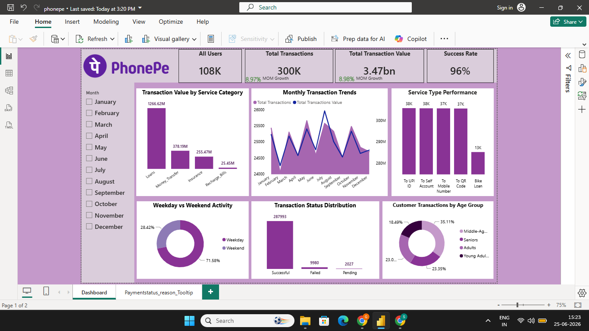

# PhonePe-Transaction-Analysis-Dashboard

## Project Overview

This Power BI project analyzes PhonePe transaction data to understand transaction performance, customer behavior, service utilization, and monthly trends. The dashboard provides interactive insights that help stakeholders monitor key business metrics and make data-driven decisions.

---

## Business Problem

Digital payment platforms process a large number of transactions daily. Businesses need a clear understanding of transaction performance, customer activity, service usage, and transaction success rates to improve operational efficiency and customer experience.

---

## Project Objective

The objective of this project was to build an interactive Power BI dashboard that:

* Tracks key transaction KPIs
* Monitors transaction performance
* Analyzes customer behavior
* Measures transaction success rates
* Identifies monthly growth trends
* Supports business decision-making

---

## Approach

* Cleaned and transformed data using Power Query.
* Created DAX measures for KPIs and Month-over-Month growth analysis.
* Built interactive visualizations using Power BI.
* Developed custom report page tooltips for detailed transaction reason analysis.
* Validated calculations and ensured data accuracy.

---

## Dashboard Features

* KPI Cards
* Monthly Transaction Trends
* Transaction Value Analysis
* Service Category Performance
* Service Type Analysis
* Transaction Status Distribution
* Customer Age Group Analysis
* Weekday vs Weekend Activity Analysis
* Interactive Slicers and Filters
* Custom Report Page Tooltips

---

## Key Metrics

* Total Users: 108,000+
* Total Transactions: 300,000+
* Total Transaction Value: ₹3.47 Billion
* Success Rate: 96%

---

## Key Insights

### Transaction Performance

* The platform processed over 300,000 transactions from 108,000 users.
* The overall transaction success rate was 96%, indicating strong platform reliability.
* Successful transactions accounted for the majority of total transactions.

### Service Category Analysis

* Loans generated the highest transaction value among all service categories.
* Money Transfers and Insurance also contributed significantly to transaction value.

### Monthly Trend Analysis

* March, May, June, July, and October recorded positive transaction growth.
* February experienced the largest decline in transaction volume.
* July recorded the highest transaction value growth of 6.35%.
* Transaction volume and transaction value generally moved in the same direction throughout the year.

### Customer Behavior Analysis

* Approximately 72% of transactions occurred during weekdays.
* Adult and middle-aged customers represented the most active user segments.

### Transaction Reason Analysis

A custom tooltip was developed to provide detailed transaction reason insights when users interact with the Transaction Status visual.

The tooltip displays:

* Successful Transactions
* Server Errors
* Wrong PIN
* Insufficient Amount
* Wrong Information
* Bank Denied

This feature improves dashboard usability by allowing users to explore transaction reasons without adding additional visuals to the main dashboard.

---

## Tools Used

* Power BI
* Power Query
* DAX
* Data Modeling
* Data Visualization

---

## Skills Demonstrated

* Data Cleaning
* Data Transformation
* DAX Calculations
* Dashboard Development
* KPI Design
* Data Validation
* Business Analysis
* Data Storytelling

---

## Dashboard Snapshot

(Add Dashboard Screenshot Here)

---

## Conclusion

This project demonstrates the use of Power BI to transform raw transaction data into meaningful business insights. Through KPI tracking, trend analysis, customer segmentation, and interactive reporting features, the dashboard enables stakeholders to monitor performance and make informed business decisions.
